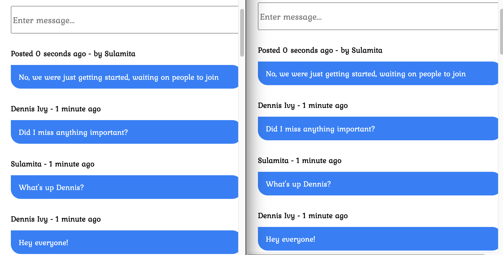

# Django Real Time Chat App

Basic chat app with public feed. Real time features added with Agora SDK.

Watch full tutorial <a href="https://youtu.be/2_mgyBD8dKc" target="_blank">Here</a>



### Getting Started


1. `git clone https://github.com/divanov11/realtime_chat_django`
2. `pip install -r requirements.txt`
3. Create an app from your account on agora.io and get your `APP ID`. 

> Note: Make sure to select "App ID only" for the authentication mechanism when creating your app in the Agora console
4. Replace the `APP_ID` value inside of `feed.html`

```js
const APP_ID = "YOU APP ID HERE"
```

5. `python manage.py runserver`
